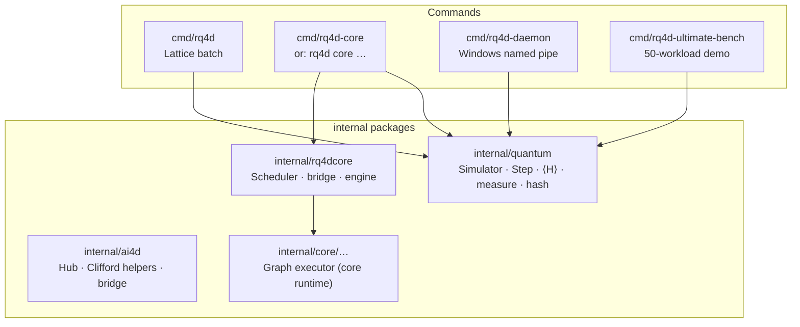

<div align="center">

# RomaQuantum4D · **RQ4D**

### High-performance **quantum lattice simulation** in pure Go

https://youtu.be/BabjOj63iOo?si=hVCBP3PVwR7Uc3zg

*3D periodic torus · complex amplitudes · Strang–Trotter dynamics · mean-field & tensor-network paths · deterministic evolution · SHA-256 state sealing*

[](https://go.dev/)
[](LICENSE)
[](https://github.com/RomanAILabs-Auth/RomaQuantum4D)

**RomanAILabs** · *Daniel Harding*  
[daniel@romanailabs.com](mailto:daniel@romanailabs.com) · [romanailabs@gmail.com](mailto:romanailabs@gmail.com)

[**Repository**](https://github.com/RomanAILabs-Auth/RomaQuantum4D) · [**Master guide**](docs/RQ4D_MASTER_GUIDE.md)

</div>

---

## Why RomaQuantum4D?

**RQ4D** is a **sovereign, dependency-light** engine for simulating quantum **many-body** physics on a **three-dimensional periodic lattice**. Instead of shipping opaque binaries tied to cloud APIs, you get:

| Capability | What it means |
|------------|----------------|
| **Local Hilbert space per site** | Dimensions **2, 4, or 8** (1–3 logical qubits per site as a qudit stack). |
| **Transverse Ising + XX bonds** | On-site fields \(h_z Z + h_x X\) plus nearest-neighbor **\(J\, X X\)** couplings on the 3D face lattice. |
| **Strang-split Trotter `Step()`** | Explicit, inspectable time evolution with fixed **\(\Delta t\)**. |
| **Mean-field & TN backends** | **`meanfield`** (product-state path) or **`tn`** with bond dimension **\(\chi \in [1,32]\)** for truncated entanglement structure. |
| **Measurement & hashing** | Optional **projective measurement**; **SHA-256** fingerprints over \(\psi\) (and TN \(\rho\) / bond data when applicable). |
| **Pure Go** | **No CGO**, no proprietary quantum cloud — build once, run on **Linux, macOS, Windows**. |

The public [GitHub **About** section](https://github.com/RomanAILabs-Auth/RomaQuantum4D) situates RQ4D inside RomanAILabs’ broader **quantum–geometric** stack (e.g. **Cl(4,0)** rotors and **Roma4D**). **This repository’s primary shipped artifact** is the **lattice simulator** and **runtime tooling** below; legacy **`.rq4d` script** examples are **not** executed by the current `rq4d` lattice CLI (see [Examples](#examples--legacy-rq4d-scripts)).

---

## Architecture (at a glance)



---

## Repository layout

| Path | Role |
|------|------|
| [`cmd/rq4d`](cmd/rq4d) | **Lattice simulator** CLI (default entry). Subcommand `core` delegates to **RQ4D-CORE**. |
| [`cmd/rq4d-core`](cmd/rq4d-core) | Standalone **core** binary (same code path as `rq4d core`). |
| [`cmd/rq4d-daemon`](cmd/rq4d-daemon) | **Windows** sidecar: **named pipe** `\\.\pipe\rq4d_quantum_bus`, worker pool, ring cache, optional prefetch warm-up. |
| [`cmd/rq4d-ultimate-bench`](cmd/rq4d-ultimate-bench) | **Fifty** reproducible lattice workloads (demo / video / regression-style harness). |
| [`internal/quantum`](internal/quantum) | **Core physics**: state layout, evolution, energy, measurement, TN bonds, hashing. |
| [`internal/rq4dcore`](internal/rq4dcore) | **Runtime**: CLI for `core`, HTTP bridge hooks, scheduler integration. |
| [`internal/ai4d`](internal/ai4d) | **AI / geometry bridge** utilities used by the broader stack. |
| [`docs/RQ4D_MASTER_GUIDE.md`](docs/RQ4D_MASTER_GUIDE.md) | Install, usage, programming, and LLM-oriented briefing. |
| [`examples/`](examples/) | Mostly **legacy `.rq4d` / `.r4d`-style** artifacts; see note below. |
| [`scripts/`](scripts/) | PowerShell helpers (some target older workflows — prefer explicit `go run` flags for the lattice engine). |

---

## Quick start

**Prerequisites:** [Go 1.22+](https://go.dev/dl/)

```bash
git clone https://github.com/RomanAILabs-Auth/RomaQuantum4D.git
cd RomaQuantum4D   # or your checkout folder name
```

### Build the lattice CLI

```bash
go build -o rq4d ./cmd/rq4d          # Unix / macOS
go build -o rq4d.exe ./cmd/rq4d      # Windows
go install ./cmd/rq4d               # installs to $GOPATH/bin or $GOBIN
```

### Run (defaults)

```bash
go run ./cmd/rq4d
```

### Representative lattice run

```bash
go run ./cmd/rq4d -lx 8 -ly 8 -lz 8 -steps 30 -dim 4 \
  -backend tn -chi 4 -dt 0.05 -j 0.3 -hz 0.2 -hx 0.15 \
  -measure -seed 7
```

### Key flags (`cmd/rq4d`)

| Flag | Meaning |
|------|---------|
| `-lx`, `-ly`, `-lz` | Torus extents (integers ≥ 1). |
| `-dim` | Local dimension **2 \| 4 \| 8**. |
| `-dt` | Trotter timestep \(\Delta t\). |
| `-steps` | Number of `Step()` calls. |
| `-j`, `-hz`, `-hx` | Coupling **J** and uniform field strengths. |
| `-backend` | **`meanfield`** \| **`tn`** \| **`cpu`** (`cpu` aliases mean-field). |
| `-chi` | Bond dimension for **`tn`** (1…32). |
| `-workers` | Worker hint (0 = `GOMAXPROCS`). |
| `-measure`, `-collapse`, `-seed` | Optional measurement pipeline. |

Output includes **norm drift telemetry**, **mean-field \(\langle H \rangle\) estimate**, and **state SHA-256**.

---

## RQ4D-CORE (`rq4d core` / `rq4d-core`)

User-space **batch · daemon · interactive** runtime with scheduler integration, optional **loopback HTTP bridge**, **pprof**, and optional **Ollama forward** route when configured.

```bash
go build -o rq4d-core ./cmd/rq4d-core

# Examples:
go run ./cmd/rq4d core --mode batch --steps 20 --backend tn --chi 2
go run ./cmd/rq4d core --mode daemon --bridge 127.0.0.1:8744 --tick-ms 100 --backend tn --chi 2
```

See `internal/rq4dcore/cli.go` and **`--help`** for **daemon**, **bridge**, **ollama-url**, **pprof**, **ring-cap**, **idle-ms**, **ai-backend**, etc.

---

## Windows sidecar: `rq4d-daemon`

**Named pipe** transport (no HTTP/TCP in the default path): clients send a **wire frame** (`RQ4D` magic + version + 32-byte SHA-256 seed); the daemon returns **bias**, **energy**, **latency**, and **status**. Workers use **thread affinity** and isolated **`quantum.Simulator`** instances for predictable throughput — suited for **LLM logit-bias** or **tight coupling** with a host process (e.g. RomanAI).

```bash
go build -o rq4d-daemon.exe ./cmd/rq4d-daemon
# Typical: rq4d-daemon --daemon  (see source for flags)
```

Pipe name (default): **`\\.\pipe\rq4d_quantum_bus`**.

---

## Ultimate benchmark (`rq4d-ultimate-bench`)

Fifty **named** scenarios (fields, geometry, **\(\chi\)**, backends, optional measurement) with:

- **Per-step** telemetry (unless `-fast`), **intro / done pauses** for screen recording, **between-test** pauses, and aggregate timing.

```bash
go run ./cmd/rq4d-ultimate-bench
go run ./cmd/rq4d-ultimate-bench -fast
go run ./cmd/rq4d-ultimate-bench -only 18 -intro-pause 3s -done-pause 2s
```

Use **`-help`** for **`intro-pause`**, **`done-pause`**, **`pause`**, **`only`**, etc.

---

## Physics & numerics (summary)

- **Topology:** periodic **3D grid**; six face neighbors per cell.
- **Hamiltonian structure (schematic):** on-site Pauli terms per local dimension stack + **XX** couplings along **x, y, z** bonds with strength **J** (see `internal/quantum` for exact indexing).
- **Evolution:** Strang-type splitting in `Step()` — mean-field path vs. **TN** path with **\(\chi\)** truncation on bonds when **`backend=tn`** and **\(\chi > 1\)**.
- **Observables:** Mean-field **energy functional** `ExpectationH()`; **global norm** checks; **SHA-256** state digest for audit / regression.

For TN **\(\chi > 1\)**, the **ψ-buffer norm** may not stay at **1** while **\(\rho\)**-centric physics is updated — treat **\(\langle H \rangle\)** and **hash** as the primary audit signals (see benchmark output notes).

---

## Examples & legacy `.rq4d` scripts

Files under [`examples/`](examples/) (e.g. `*.rq4d`, companion **Roma4D** `*.r4d` in older docs) often target **historical** script runners or **narrative demos**. The **current** `rq4d` binary is the **lattice engine** documented above — it does **not** execute those scripts as a shell. Keep them as **reference**, or run **Roma4D** sources with the **`r4d`** toolchain from a [Roma4D](https://github.com/RomanAILabs-Auth/Roma4D) checkout where applicable.

---

## Module

```text
github.com/RomanAILabs-Auth/RomaQuantum4D
```

Import as a **library** only from modules allowed to reference **`internal/`** (same module tree per Go rules).

---

## Documentation

| Doc | Description |
|-----|-------------|
| [**RQ4D_MASTER_GUIDE.md**](docs/RQ4D_MASTER_GUIDE.md) | Install, daily use, extension points, LLM briefing. |
| **This README** | Orientation, binaries, flags, layout. |

---

## Contributing

Issues and PRs are welcome against [**RomanAILabs-Auth/RomaQuantum4D**](https://github.com/RomanAILabs-Auth/RomaQuantum4D). Please keep changes **focused**, **tested** (`go test ./...`), and **gofmt** clean.

---

## Security

If you discover a security issue, please contact the maintainer via the emails above instead of filing a public issue first.

---

## License

Licensed under the **Apache License 2.0** — see [LICENSE](LICENSE).

---

## Copyright

**Copyright © Daniel Harding — RomanAILabs.**  
All rights reserved where not granted under the LICENSE.

---

<div align="center">

**RomaQuantum4D** · *Understand the lattice. Ship the kernel. Own the runtime.*

[↑ Back to top](#romaquantum4d--rq4d)

</div>
